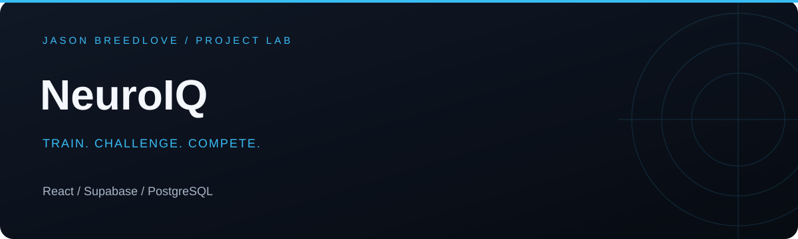

[Open live app](https://neuroiq.jasonbreedlove.dev) · [Portfolio](https://www.jasonbreedlove.dev) · [Browse source](https://github.com/Breedlove-Jason/takeneuroiq)

# NeuroIQ

A cognitive puzzle competition platform with adaptive practice, player progression, ranked challenges, and scoreboards.

## Explore

- Practice puzzle families with directions and session feedback.
- Challenge other players and review competitive results.
- Track progression, scores, and rankings.
- Review personal session analytics in a responsive React interface.

## Engineering focus

| Area | Implementation |
| --- | --- |
| Interface | React, Vite, Tailwind CSS, Phosphor icons |
| Accounts and persistence | Supabase authentication and PostgreSQL |
| Competition | Database migrations for accounts, scores, competition, and question timing |
| Practice | Puzzle generation, answer checking, session tracking |
| Analytics | Session trends, puzzle-family feedback, adaptive difficulty |

## Run locally

Use Node.js 22.12 or newer.

```sh
npm ci
cp .env.example .env
npm run dev
```

Set `VITE_SUPABASE_URL` and `VITE_SUPABASE_PUBLISHABLE_KEY` for your own Supabase project. These are browser configuration values; never substitute a service-role secret. Apply the SQL migrations in `supabase/migrations/` in order to a development project.

```sh
npm test
npm run lint
npm run build
```

## Deployment and accounts

The live app is hosted on Vercel. Configure the public Supabase variables, database migrations, authentication site URL, and allowed redirects for the deployment. Authentication email delivery is configured in Supabase, separately from the frontend build.

## Code map

- `src/game/`: puzzle generation and session logic
- `src/analytics/`: feedback and progression helpers
- `src/pages/`: play, competition, rankings, and profile screens
- `src/lib/supabase.js`: database client configuration
- `supabase/migrations/`: persisted competition schema and functions
- `tests/`: automated logic and integration checks

## Scope

NeuroIQ is a puzzle and competition project, not a clinical assessment or validated IQ test. Scores describe performance within the app. Claims about health outcomes, intelligence measurement, or cheating prevention beyond the implemented checks are not made.
